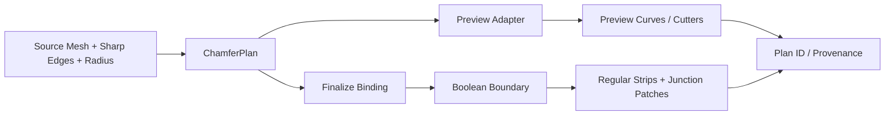

# Feature Chamfer 通用化后续推进计划

> 日期：2026-07-22；目标入口：`hst.feature_chamfer_gn`；适用 Blender：5.0+；当前验证环境 Blender 5.1.2。
> 用途：每个 Phase 交给一个独立 AI agent session；禁止跨阶段抢跑。

## 0. 执行结论

当前算法不是完全不可用，但已有证据足以判定：它只在少数已适配组合上成功，尚不具备产品级通用性。

- runtime wiring 已达到 `INTEGRATED`：真实 `hst.feature_chamfer_gn` 的 `PREVIEW → FINALIZE` 确实走了新 backend。
- mixed / `Extruded.002` / radius=0.01 已达到局部 `VERIFIED`。
- “Feature Chamfer 通用化”整体仍是 `PROTOTYPE / NOT VERIFIED`，不能沿用旧文档中的整体完成表述。
- 当前完整回归 81/81 中，tricky_b 的若干 case 把“结构化 fail-closed”记为 PASS；这属于安全回归，不是产品成功。
- radius=0.03 的当前抽样仅 1/7 成功；5 个复杂对象在 radius=0.01 时仅 mixed 1/5 成功。

后续不继续堆模型特判，也不先优化性能。主线是消除 Preview 与 Finalize 的语义分叉，建立可诊断、可复用的 `ChamferPlan`，再按失败家族逐层泛化。

## 1. 目标入口契约

每个 Phase 开始和结束都必须核对：

```text
UI：Feature Chamfer GN
→ Operator：hst.feature_chamfer_gn
→ action：PREVIEW / FINALIZE
→ shared semantic plan：ChamferPlan
→ Preview adapter / Finalize adapter
→ 用户可见槽预览 / closed-manifold 重建结果 / 结构化 unsupported 原因
```

目标不是让离线 probe 能生成 Mesh，而是让同一目标 Operator 在用户提供的真实文件中稳定工作。



### 1.1 预期的深 Module 边界

Phase 2 才确定精确 dataclass 字段；在此之前只冻结最小接口意图：

```text
build_chamfer_plan(source_mesh, feature_edges, radius, contract) -> ChamferPlan
build_preview_from_plan(plan) -> PreviewArtifact
bind_boolean_boundary(plan, boolean_mesh) -> FinalizationBinding
build_final_mesh(plan, binding) -> FinalArtifact
validate_plan / validate_binding / validate_final_artifact -> Diagnostics
```

`ChamferPlan` 至少表达：

- source fingerprint、radius、input contract、plan ID；
- FeatureStrand 与它们在 junction 处的端口；
- Cutter/Pipe spec，以及 Sharp Edge 到 cutter 的 provenance；
- 预期 regular region、junction region 与允许的 occluded endpoint；
- 不支持区域的结构化原因，而不是静默 fallback。

`FinalizationBinding` 至少表达：

- 原始 Boolean Boundary Edge/Vertex，不移动、不重采样；
- RailChain 与 JunctionPort 的边范围，而不是“必须单条 endpoint Edge”；
- StripCorrespondence 及其 owner Surface / port constraint；
- 每条 Boundary Edge 的唯一消费账本或显式 multi-owner seam；
- plan ID 和完整 provenance，证明 PREVIEW 与 FINALIZE 使用同一语义计划。

不要把复杂度变成调用侧的 option bag；复杂度必须隐藏在 Module 内。

## 2. 当前证据基线

测试输入全部随 Git 仓库分发，路径相对 repository root。agent 禁止依赖开发者 Desktop、盘符或用户名；所有 runner 必须从 `tests/fixtures/` 解析输入。

| fixture（repo-relative） | SHA-256 | 说明 |
|---|---|---|
| `tests/fixtures/feature-chamfer-product-simple.blend` | `1CBAB4C83C4D9F77BD2B0799257953AAEC32AA416994A1D8810425F3C2B94D8C` | simple 产品矩阵源文件 |
| `tests/fixtures/feature-chamfer-product-tricky.blend` | `C7F57A54837A04F7E52B535BB47AF0ABEB05FCA4193DAC714FB3667EFB426F02` | tricky 产品矩阵源文件 |
| `tests/fixtures/feature-chamfer-product-tricky-b.blend` | `A4C121B6BBBFFF58B94C3B7ED11BD82FE59C88A92569389FD27593ED65BE9A35` | tricky-b 产品矩阵源文件 |
| `tests/fixtures/feature-chamfer-topology-defect-mixed.blend` | `80DA3EE4144BA83CAB4E9BED980C8829D846369F22A694ABFE1AA513C3A3D1B8` | mixed 产品矩阵源文件；与原始样本内容一致 |

| 文件 / 对象 | radius 0.01 | radius 0.03 | 当前主要失败 |
|---|---:|---:|---|
| `feature-chamfer-product-simple.blend / Extruded.002` | 未跑 | 成功 | — |
| `feature-chamfer-product-simple.blend / Solid 44` | 未跑 | 失败 | `ambiguous_boundary` |
| `feature-chamfer-product-tricky.blend / Solid.004` | 失败 | 失败 | `ambiguous_boundary` |
| `feature-chamfer-product-tricky.blend / Solid.016` | 失败 | 失败 | `SIGNED_STRIP_WIDTH_EXCEEDED` |
| `feature-chamfer-product-tricky-b.blend / Extruded.003` | 失败 | 失败 | 0.01 width；0.03 `shared_rail_invalid` |
| `feature-chamfer-product-tricky-b.blend / Extruded.002` | 失败 | 失败 | `SIGNED_STRIP_WIDTH_EXCEEDED` |
| `feature-chamfer-topology-defect-mixed.blend / Extruded.002` | 成功 | 失败 | 0.03 `shared_rail_invalid` |

已知性能样本：

- simple / `Extruded.002` / 0.03：Preview ≈0.053s，Finalize ≈0.925s；
- mixed / 0.01：Preview ≈2.508s，Finalize ≈11.866s；
- mixed / 0.03：Preview ≈2.534s，Finalize ≈13.225s；其中 Boolean ≈1.566s，主要耗时不只在 Boolean；
- `Solid 44` Preview ≈3.324s，feature graph 已是明显热点。

这些数字只用于冻结基线，不得在 Phase 7 前以牺牲正确性优化。

### 2.1 失败家族与待证伪假设

1. `ambiguous_boundary`：BoundaryGraph 假定 rail vertex degree=2，无法表达 junction graph；需要 maximal degree-2 strands + explicit JunctionPorts。
2. `regular_patch_shared_rail_invalid`：实现假定 shared rail 是单条 endpoint Edge；实际可能是 chain/range/port，并需要消费所有权。
3. `SIGNED_STRIP_WIDTH_EXCEEDED`：correspondence/guard 可能把合法 unequal density、terminal 或 owner Surface 情形当作跨槽配对；禁止直接放宽阈值。
4. radius 敏感：缺少明确的局部 feature-size contract，或 plan 在不同半径下发生不受控的拓扑语义变化。
5. Preview/Finalize 分叉：Preview 的视觉正确不能传递给 Finalize，因为二者没有共享可核对的 semantic plan。

## 3. 全局硬约束

- 禁止修改 `auto_load.py`；fixture 视为 immutable test input，测试只能另存 artifact，不得覆盖 fixture。
- 禁止写死 Windows/macOS 本地绝对路径；文档、脚本和命令以 repository root 为基准。
- 禁止在 production 代码中写 object name、vertex index、坐标、fixture hash 等模型特判。
- 禁止 junction center fan、通用 Fill、全局 hole fill 或吞异常让 case 变绿。
- 禁止通过放宽 width/radius/self-intersection 阈值掩盖错误 correspondence。
- 禁止把 `FINISHED`、字段存在、topology clean、单一 `.blend`、测试总数或 fail-closed PASS 当作产品成功。
- 每个 solver 规则由“几何不变量 + 最小合成 case + 至少两个不同真实对象”共同证明。
- 不开新分支；保留用户已有改动；每个 Phase 达到 Go 后单独 commit。
- 前一 Phase 未 Go，后一 Phase 只能更新设计/诊断，禁止接入正式 runtime path。
- 每次结束清理 Blender/调试进程；artifact 保留在 `tests/artifacts/`。

## 4. 状态与测试语义

状态只允许：`PROTOTYPE`、`INTEGRATED`、`VERIFIED`、`ACCEPTED`。

每个 matrix cell 必须分类：

- `PRODUCT_SUCCESS`：目标 Operator 完成并通过四层门槛。
- `EXPECTED_UNSUPPORTED`：输入明确违反已批准 input contract，并返回精确稳定原因。
- `REGRESSION_FAILURE`：合同内输入未得到正确产品结果。
- `SAFETY_PASS`：已知失败被安全阻止；不能计入产品成功率。

不得把 `REGRESSION_FAILURE` 直接改成 `EXPECTED_UNSUPPORTED` 来提高通过率；必须先证明源 Mesh 违反事先写明的合同。

## 5. Phase 0 — 冻结产品矩阵与输入合同

**状态目标：** `PROTOTYPE` 基线可信；**目标 Operator：** `hst.feature_chamfer_gn`。

**用户操作：** 对矩阵对象依次 PREVIEW→FINALIZE。
**预期可见变化：** 无算法变化；只得到可重复结果。

### 任务

1. 校验上述四个 repo fixture 的 SHA-256，记录 Blender 版本、对象、transform、manifold、degenerate、Sharp Edge 数量和局部 feature-size。
2. 建立 product matrix runner，必须调用目标 Operator，不能直调 builder；输入路径从 repository root / runner 文件位置解析。
3. runner 必须在 Windows 与 macOS 接受自动发现的 Blender，或通过 `--blender <path>` 显式覆盖；不得内置某台机器的 Blender 路径。
4. 跑 7 个对象 × radius {0.01, 0.03}，至少两次；检测结果和 fingerprint 稳定性。
5. regression 输出拆成四种产品语义。
6. 起草 input contract：closed manifold、Sharp Edge、transform/scale、允许 junction、radius 与局部 feature size。未知项保持未决，不能先排除失败 fixture。

### 证据

- `tests/artifacts/feature_chamfer_matrix/results.json`
- `tests/artifacts/feature_chamfer_matrix/<case>/preview.blend`
- `tests/artifacts/feature_chamfer_matrix/<case>/final.blend`
- `tests/artifacts/feature_chamfer_matrix/<case>/diagnostics.json`
- `docs/diagnostics/feature-chamfer-generalization/phase-0-baseline.md`

### Go / Stop

- Go：14 个 cell 全有稳定结果；source fingerprint 未变；四类语义正确；runner 证明经过目标 Operator。
- Stop：同 cell 非确定；source 被修改；或无法证明 runtime path。

### Commit

`test(feature-chamfer): establish product generalization matrix`

## 6. Phase 1 — 建立失败剖面与可解释诊断

**状态目标：** `PROTOTYPE` 根因输入充分；**目标 Operator：** 不改行为，只让其输出精确诊断。

**用户操作：** 同 Phase 0。
**预期可见变化：** 失败结果不变，但每个失败可以定位到 graph/port/span/edge。

### 任务

1. 给每个失败记录：feature group/span、Boundary component、vertex degree histogram、Rail candidate、owner Patch、JunctionPort、radius-normalized metrics。
2. 为 `ambiguous_boundary` 输出 degree≠2 的局部 graph 和最大 degree-2 runs。
3. 为 `shared_rail_invalid` 输出期望端口、实际 Edge chain/range、multi-owner seam 和消费冲突。
4. 为 width failure 输出 correspondence 两侧 owner、采样密度、signed width 序列、失败位置、候选切换点；不修改 guard。
5. 对 pipeline 分段计时：feature graph、pipe/cutter、Boolean、boundary classify、binding、regular strips、junction、validation、cleanup。
6. 保存最小局部 `.blend`/JSON；验证诊断本身不改变算法输出。

### Go / Stop

- Go：每个失败 cell 可归入一个主失败家族；诊断具有稳定 IDs；同家族至少有两个不同真实对象。
- Stop：错误只能靠 BMesh 临时 index 定位；或插桩改变拓扑/结果。

### Commit

`diagnostics(feature-chamfer): classify generalization failures`

## 7. Phase 2 — 原型化共享 ChamferPlan

**状态目标：** `PROTOTYPE`；严禁先宣称 Operator 已修复；**目标 Operator：** 保持产品行为，只并行构建和核对 plan。

**用户操作：** PREVIEW 与 FINALIZE 各运行一次。
**预期可见变化：** 无；artifact 中出现相同 plan ID/provenance。

### 任务

1. 写 contract test，定义 `ChamferPlan`、FeatureStrand、JunctionPort、RailChain、StripCorrespondence、UnsupportedRegion 的不变量。
2. 从现有 Preview graph 生成 immutable plan；Preview adapter 只读取 plan。
3. Finalize 在 Boolean 后只做 boundary binding，不重新发明 feature topology。
4. shadow mode 运行：新 plan 不驱动最终 Mesh，但与旧路径逐项对照。
5. mixed 0.01 与 simple 0.03 必须产生相同视觉/拓扑结果；Preview/Finalize plan ID 相同。
6. 失败 fixture 也要生成可解释 incomplete/unsupported plan，不能崩溃或静默降级。

### 四层证据

- Algorithm：plan deterministic（至少重复 3 次）、coverage ledger 完整。
- Backend：Preview adapter 可复现已接受 cutter；binding 不移动 Boolean Boundary。
- Operator：日志证明 PREVIEW/FINALIZE 使用同一 plan ID。
- Visual：本 Phase 不宣称新增模型视觉通过。

### Go / Stop

- Go：现有成功 case 零回归；plan fingerprint 稳定；两条 runtime action 共享 plan 语义。
- Stop：需要在 adapter 中重新推断 feature group；或 Preview/Finalize plan 不一致。

### Commit

`refactor(feature-chamfer): introduce shared chamfer plan seam`

## 8. Phase 3 — 泛化 BoundaryGraph 与 JunctionPort

**失败目标：** `ambiguous_boundary`；**首批真实 case：** simple / `Solid 44`，tricky / `Solid.004`。
**状态目标：** Algorithm→Backend→Operator 逐级达到 `INTEGRATED`。

### 任务

1. 把 Boundary component 分解为 maximal degree-2 RailStrands；degree≠2 顶点成为显式 JunctionNode。
2. strand endpoint 通过 JunctionPort 绑定到 feature/group/owner Patch；不得猜最近 Pipe。
3. 对 cyclic、open、multi-branch component 分别定义不变量和失败原因。
4. 先补最小合成 Y/T/X junction test，再验证两个不同真实对象。
5. Backend 通过后才接入 `hst.feature_chamfer_gn`；产出固定近景 artifact。

### Go / Stop

- Go：两个目标对象不再出现 `ambiguous_boundary`；Boundary Edge consumption=100%；无坐标重排/插值；目标 Operator source unchanged。
- Stop：只是跳过 degree≠2 区域；使用全局 Fill；或只修一个 fixture。

### Commit

`fix(feature-chamfer): decompose boundary junction strands`

## 9. Phase 4 — 泛化 Shared Rail 为端口范围

**失败目标：** `regular_patch_shared_rail_invalid`；**首批真实 case：** tricky_b / `Extruded.003` / 0.03，mixed / `Extruded.002` / 0.03。
**状态目标：** `INTEGRATED`。

### 任务

1. 将 single endpoint Edge contract 替换为 `JunctionPortRange`：有序 Edge chain、端点、方向、owner set、消费规则。
2. 建立 edge ownership ledger：single-owner、explicit shared seam、occluded endpoint 三类互斥且完备。
3. regular strip 只消费分配给自己的 port range；junction solver 消费剩余显式端口。
4. 保留 Boolean Boundary coordinates/adjacency；不按 centerline 排序，不线性重采样。
5. 最小 test 覆盖单边、多边 shared range 和 multi-owner seam，再跑两个真实 case。

### Go / Stop

- Go：两个 case 的 shared-rail failure 消失；consumed=boundary total、missing=extra=unclassified=0；旧 mixed 0.01 不回归。
- Stop：通过裁掉/忽略 fragment 过关；或一个 Edge 被两个 regular strip 隐式消费。

### Commit

`fix(feature-chamfer): model shared rails as junction port ranges`

## 10. Phase 5 — 泛化 StripCorrespondence

**失败目标：** `SIGNED_STRIP_WIDTH_EXCEEDED`；**首批真实 case：** tricky / `Solid.016`，tricky_b / `Extruded.002`；并复测 tricky_b / `Extruded.003`。
**状态目标：** `INTEGRATED`，随后 matrix `VERIFIED`。

### 任务

1. 冻结 width guard；先证明失败是配对错误还是合法 radius 超出 input contract。
2. correspondence 只能在同 FeatureStrand、兼容 owner Surface、匹配 JunctionPort 区间内搜索。
3. 支持 unequal vertex density；使用单调、无折返的参数对应，不要求两 rail 同样本数。
4. cyclic strip 使用独立 seam choice 与 rotation invariance；terminal strip 使用 port anchors。
5. 输出 signed width envelope、orientation、self-intersection、face quality 和未消费区间。
6. 最小 test 覆盖 unequal density、cyclic shift、terminal range、相邻但错误 Surface；再验证两个真实对象。

### Go / Stop

- Go：目标对象在合同内半径成功；不靠放宽 guard；Boundary/non-manifold/zero-area=0；旧成功矩阵不回归。
- Stop：width 仅因阈值变大而通过；出现 flipped faces、rail crossing 或 source mutation。

### Commit

`fix(feature-chamfer): constrain strip correspondence by surface ports`

## 11. Phase 6 — 产品矩阵集成与真实视觉验收

**状态目标：** 自动 `VERIFIED`，用户确认后 `ACCEPTED`；**目标 Operator：** `hst.feature_chamfer_gn`。
**用户操作：** 在四个真实文件中逐对象 PREVIEW→FINALIZE。

### 自动门槛

1. **Algorithm**：plan deterministic；selected Sharp Edges coverage=100%；所有 port/region 有 owner 或结构化 unsupported。
2. **Backend**：Boundary=0、non-manifold=0、zero-area=0；消费账本 100%；无 flipped/self-intersect/sliver（阈值按 radius/局部 feature-size 归一化）。
3. **Operator**：PREVIEW/FINALIZE 均从目标入口；source fingerprint 不变；独立 output；plan ID 一致。
4. **Visual/Product**：每个 cell 保存固定 camera 的 source/preview/final close-up；量化 preview center/radius 与 final groove 偏差；用户 UI 验收。

### 产品 Go 条件

- 所有符合 input contract 的 14 个 cell 都是 `PRODUCT_SUCCESS`；
- 若有 `EXPECTED_UNSUPPORTED`，必须在合同中预先定义并由输入证据直接证明，不能源自 solver 当前能力不足；
- `SAFETY_PASS` 单独报告，产品成功率不包含它；
- 完整回归通过，但回归总数只作辅助证据。

### 验证命令

```text
python tools/run_blender_tests.py
# Blender 未加入 PATH 时：
python tools/run_blender_tests.py --blender <path-to-blender-executable>
```

再运行 Phase 0 建立的 product matrix runner。若新增测试类别，更新 `tests/README.md`。

### Commit

`test(feature-chamfer): verify product matrix through operator`

用户 UI 通过后另做文档 commit：

`docs(feature-chamfer): record product acceptance matrix`

## 12. Phase 7 — 性能剖析与优化

**前置：** Phase 6 自动 `VERIFIED`。算法未通过前禁止进入。
**状态目标：** 正确性零回归下改善耗时。

### 任务

1. 用 Phase 1 timers 冻结每个 cell 的 wall time、分段时间、Mesh/plan 规模；warm/cold 各跑至少 3 次。
2. 先识别 top 2 热点；候选是 feature graph、重复 BVH/adjacency、per-span Python loops、final validation/cleanup，但必须以数据为准。
3. 优先缓存 immutable plan 数据、批量 BMesh/BVH 查询、消除同一 action 内重复拓扑扫描。
4. 每次只优化一个热点；前后 output fingerprint、拓扑指标、固定近景必须相同。
5. Phase 7A 提交 profiling；性能目标由用户基于基线确认后，Phase 7B 才改实现，不先拍脑袋定绝对秒数。

### Go / Stop

- Go：用户批准的性能目标达到；14-cell product matrix 与完整回归零变化。
- Stop：依靠降低 resolution、跳过 validation 或更改可见几何换速度。

### Commit

- `perf(feature-chamfer): add phase timing baselines`
- `perf(feature-chamfer): optimize <measured-hotspot>`

## 13. Phase 8 — 独立 Spec Audit 与长期文档

必须由未参与该阶段实现的独立 agent/审查过程执行；只读审查后再决定是否修复。

核对：

- diff 是否真的修改目标 runtime path；
- 每个 Phase 的 Go 是否有直接 artifact；
- 是否有 object/coordinate/index 特判、越阶段实现或 scope creep；
- 测试是否从 `hst.feature_chamfer_gn` 开始；
- fail-closed PASS 是否被错误计入产品成功；
- 文档状态是否与代码和用户可见行为一致；
- 旧 mixed case、所有新 fixture、source immutability 是否保持。

高严重度偏差未清零，禁止宣称 `VERIFIED/ACCEPTED`。

### Commit

`docs(feature-chamfer): complete independent generalization audit`

## 14. 每个独立 session 的执行协议

1. 先读项目 `AGENTS.md`、本计划、`tests/TESTING_POLICY.md`、上一 Phase 诊断与 artifact。
2. 只领取一个 Phase；开始前写明目标 Operator、用户动作、可见变化、自动证据、Go 条件。
3. 先定位 UI→Operator→action→runtime path；若实际入口不同，立即停下更新计划。
4. 先加能失败的最小测试/矩阵断言，再做最小充分修改。
5. 运行 Phase 最小验证；核心路径变化再跑完整回归。
6. 更新 Phase 文档状态；达到 Go 才 commit。Stop 时只能提交诊断/设计，不得接下一阶段。
7. 结束前执行 `git status --short`，保留无关用户改动，清理 Blender/调试进程。

每次交付统一格式：

```text
状态：PROTOTYPE / INTEGRATED / VERIFIED / ACCEPTED
目标 Operator：hst.feature_chamfer_gn
本轮唯一 Phase：
用户可见变化：
直接证据与 artifact：
产品矩阵变化：
未通过门槛：
本轮明确未做：
验证命令与结果：
Commit：
```

## 15. 可直接复制给新 session 的 Prompt

### Phase 0 首发 Prompt

```text
按仓库内 docs/plan/2026-07-22-feature-chamfer-generalization-roadmap.md 执行 Phase 0，且只执行 Phase 0。

先读取项目 AGENTS.md、tests/TESTING_POLICY.md、现有 Feature Chamfer 诊断。测试文件只取自 tests/fixtures/ 中本计划列出的四个 fixture，所有路径从 repository root 解析。目标入口固定为 UI Feature Chamfer GN → hst.feature_chamfer_gn → PREVIEW/FINALIZE。建立 7 个真实对象 × radius {0.01, 0.03} 的产品矩阵，严格区分 PRODUCT_SUCCESS、EXPECTED_UNSUPPORTED、REGRESSION_FAILURE、SAFETY_PASS。不得修改算法或 fixture，不得把 fail-closed 当产品成功。

达到 Phase 0 Go 条件后更新 phase-0-baseline.md，运行最小验证并 commit；未达到时只提交诊断，不进入 Phase 1。交付时使用计划中的统一格式。
```

### 后续 Phase 通用 Prompt

```text
按仓库内 docs/plan/2026-07-22-feature-chamfer-generalization-roadmap.md 执行 Phase <N>，且只执行该 Phase。

先核验 Phase <N-1> 是否有 Go 证据；没有则停止实现，只报告门禁缺口。目标入口始终是 hst.feature_chamfer_gn 的 PREVIEW→FINALIZE。禁止模型特判、通用 Fill、阈值放宽和 source mutation。先补最小失败测试，再做最小充分修改；用两个不同真实对象证明通用规则。达到 Go 后更新诊断、运行必要回归并单独 commit。交付时报告四层证据、矩阵变化、未通过门槛和明确未做范围。
```

## 16. 本轮明确不做

- 不在计划撰写阶段修改任何 Feature Chamfer 实现或测试。
- 不承诺任意坏拓扑、non-manifold、zero-thickness CAD 输入可自动修复。
- 不重做 UI，不更改已获认可的 Preview 视觉语义。
- 不在通用性通过前做性能优化。
- 不用当前 81/81 回归数字宣称产品通用性。
